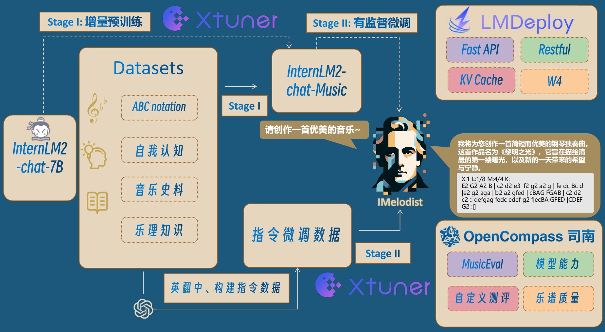

# IMelodist

> _Music is a higher revelation than all wisdom and philosophy._ — Ludwig van Beethoven

[](https://openxlab.org.cn/models/detail/EchoPeter/IMelodist)
[]()
[-Datasets?style=flat&logoColor=%235c5c5c&label=%F0%9F%A4%97Huggingface&color=%23d9b125)](https://huggingface.co/datasets/PommesPeter/imelodist-increment)
[-Datasets?style=flat&logoColor=%235c5c5c&label=%F0%9F%A4%97Huggingface&color=%23d9b125)](https://huggingface.co/datasets/PommesPeter/imelodist-sft)


Melodist large model based on InternLM2-chat. 

[📖Technical Report](assets/TechnicalReport/) |
[🌐Video Demo](https://www.bilibili.com/video/BV13j421o7nZ/?spm_id_from=333.999.0.0&vd_source=ed4c533bf4cce5e0d0329d8c60182037)  |
[🎼IMelodist-app](https://openxlab.org.cn/apps/detail/EchoPeter/IMelodist-app)

## 📝 Index

- [🤖 Basic Framework](#-Basic-Framework)
- [🚀 News](#-news)
- [🛠️ How to start](#-How-to-start)
  * [快速开始](#安装依赖)
  * [重新训练](#下载模型)
  * [运行 Web Demo](#-运行-Web-Demo)
- [🌟 Future](#-Future)
- [📄 Related resources](#-Related-resources)
- [❤️ Acknowledgement](#-Acknowledgement)
- [🖊️ BibTeX entry and citation info](#-BibTeX-entry-and-citation-info)
- [🧾 开源许可证](#-开源许可证)

## 🤖 Basic Framework



## 🛠️ How to start

#### 安装依赖

```shell
# 此处我们使用的环境是 Ubuntu 20.04, 其他系统自行寻找相应的库安装
sudo xargs -r -a packages.txt apt-get install -y
pip install -r requirements.txt
```
#### 下载模型

提供了两种下载方式：

- 从 OpenXLab 上下载
```shell
git lfs install
git clone https://code.openxlab.org.cn/EchoPeter/IMelodist.git
```

或者

参考 [下载模型](https://openxlab.org.cn/docs/models/%E4%B8%8B%E8%BD%BD%E6%A8%A1%E5%9E%8B.html) 。

```bash
pip install openxlab
```

```python
from openxlab.model import download
download(model_repo='EchoPeter/IMelodist', 
        model_name='IMelodist', output='./')
```

- 从 Modelscope 下载
参考 [模型的下载](https://www.modelscope.cn/docs/%E6%A8%A1%E5%9E%8B%E7%9A%84%E4%B8%8B%E8%BD%BD) 。

```bash
pip install modelscope
```

```python
from modelscope.hub.snapshot_download import snapshot_download
model_dir = snapshot_download('PommesPeter/IMelodist-chat-7b', cache_dir='./')
```

#### 运行 Web Demo

将 [IMelodist_demo.py](https://github.com/GuoYiFantastic/IMelodist/blob/main/chat/IMelodist_demo.py) 文件中第42行的 `model_path` 改成本地 IMelodist **模型**所在路径后，运行以下指令。

```shell
# 确保terminal所在位置为repo主目录
streamlit run chat/IMelodist_demo.py --server.address=0.0.0.0 --server.port 7860
```

## 🌟 Future

- 扩展 Internlm2-7B 的能力，接入音乐生成功能
- 更高质量的音乐知识、自我认知等数据
- 通用的 ABC 乐谱模板匹配
- 支持 ABC 乐谱格式转换 (wav, midi, etc.)

## 📄 Related resources
- **[2024/3/17]** 书生·浦语 训练营 SIG小组 圆桌分享 [[视频](https://www.bilibili.com/video/BV1xr421n7MA/?vd_source=ed4c533bf4cce5e0d0329d8c60182037), [slide](https://github.com/GuoYiFantastic/IMelodist/blob/main/assets/TechnicalReport/IMelodist_0317%E5%9C%86%E6%A1%8C%E5%88%86%E4%BA%AB.pdf)]

## ❤️ Acknowledgement

- 感谢 [**上海人工智能实验室**](https://www.shlab.org.cn) 举办的各项赛事和活动~
- 感谢 [**书生·浦语开源实训营**](https://github.com/InternLM) 的技术指导以及算力支持~
- 感谢 **OpenXLab** 对项目部署的算力支持~
- 感谢 **浦语小助手** 对项目的支持~
- 感谢 [**sander-wood**](https://huggingface.co/datasets/sander-wood/irishman) 和 [**m-a-p**](https://huggingface.co/m-a-p) 的开源数据集
- [**InternLM-tutorial**](https://github.com/InternLM/tutorial)、[**InternStudio**](https://studio.intern-ai.org.cn/)、[**xtuner**](https://github.com/InternLM/xtuner)
</div>

## Contributors

<a href = "https://github.com/GuoYiFantastic/InternLM2-Beethoven/graphs/contributors">
  
</a>

## Star History

[](https://star-history.com/#GuoYiFantastic/IMelodist&Date)

## BibTeX entry and citation info

```bibtex
@inproceedings{DBLP:conf/hcmir/WuLY023,
  author       = {Shangda Wu and
                  Xiaobing Li and
                  Feng Yu and
                  Maosong Sun},
  editor       = {Lorenzo Porcaro and
                  Roser Batlle{-}Roca and
                  Emilia G{\'{o}}mez},
  title        = {TunesFormer: Forming Irish Tunes with Control Codes by Bar Patching},
  booktitle    = {Proceedings of the 2nd Workshop on Human-Centric Music Information
                  Retrieval 2023 co-located with the 24th International Society for
                  Music Information Retrieval Conference {(ISMIR} 2023), Milan, Italy,
                  November 10, 2023},
  series       = {{CEUR} Workshop Proceedings},
  volume       = {3528},
  publisher    = {CEUR-WS.org},
  year         = {2023},
  url          = {https://ceur-ws.org/Vol-3528/paper1.pdf},
  timestamp    = {Tue, 19 Dec 2023 17:15:12 +0100},
  biburl       = {https://dblp.org/rec/conf/hcmir/WuLY023.bib},
  bibsource    = {dblp computer science bibliography, https://dblp.org}
}
```
```bibtex
@misc{yuan2024chatmusician,
      title={ChatMusician: Understanding and Generating Music Intrinsically with LLM}, 
      author={Ruibin Yuan and Hanfeng Lin and Yi Wang and Zeyue Tian and Shangda Wu and Tianhao Shen and Ge Zhang and Yuhang Wu and Cong Liu and Ziya Zhou and Ziyang Ma and Liumeng Xue and Ziyu Wang and Qin Liu and Tianyu Zheng and Yizhi Li and Yinghao Ma and Yiming Liang and Xiaowei Chi and Ruibo Liu and Zili Wang and Pengfei Li and Jingcheng Wu and Chenghua Lin and Qifeng Liu and Tao Jiang and Wenhao Huang and Wenhu Chen and Emmanouil Benetos and Jie Fu and Gus Xia and Roger Dannenberg and Wei Xue and Shiyin Kang and Yike Guo},
      year={2024},
      eprint={2402.16153},
      archivePrefix={arXiv},
      primaryClass={cs.SD}
```

```bibtex
@misc{2024imelodist,
      title={IMelodist: Music Large Language Model from Internlm2-7B finetuning}, 
      author={IMelodist Contributor},
      year={2024},
      url={https://github.com/GuoYiFantastic/IMelodist}
}
```

## 🧾 开源许可证

该项目采用 Apache License 2.0 开源许可证 同时，请遵守所使用的模型与数据集的许可证。
